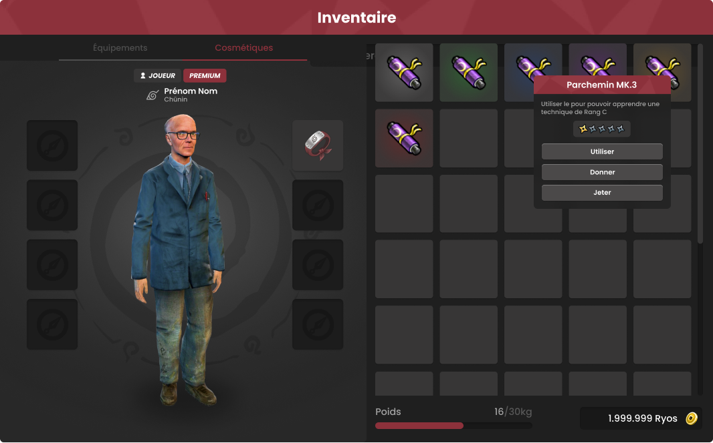

# Cahier des charges - [Yutopia]

**Cahier des charges pour la réalisation d'un menu d'inventaire**  

- **Prestataire** : [CONFIDENTIEL]  
- **Date** :        [26/01/25]  
- **Version** :     1.0  

---

## Sommaire  
1. [Contexte et Objectif de la Prestation](#1-contexte-et-objectif-de-la-prestation)  
2. [Éléments à réaliser](#2-éléments-à-réaliser)  
3. [Normes et Fonctionnalités](#3-normes-et-fonctionnalités)  
4. [Effets visuels et Responsiveness](#4-effets-visuels-et-responsiveness)  
5. [Maquette Visuelle](#5-maquette-visuelle)  
6. [Livrables attendus](#6-livrables-attendus)  
7. [Délais de réalisation](#7-délais-de-réalisation)  
8. [Budget et Conditions](#8-budget-et-conditions)  
9. [Critères de Validation](#9-critères-de-validation)  
10. [Confidentialité](#10-confidentialité)  
11. [Propriété Intellectuelle](#11-propriété-intellectuelle)  
12. [Non-concurrence](#12-non-concurrence)  
13. [Modifications post-livraison](#13-modifications-post-livraison)  
14. [Applicabilité des Clauses](#14-applicabilité-des-clauses)  
15. [Contact](#15-contact)  

---

## 1. Contexte et Objectif de la Prestation  
Le présent cahier des charges a pour objectif de définir les spécifications techniques et fonctionnelles pour la réalisation d'un menu d'inventaire interactif dans le cadre du projet communautaire **Yutopia**, sur le jeu **Garry's Mod**.  

Le back-end du module d'inventaire est déjà implémenté, et cette prestation porte exclusivement sur la création de la partie front-end, à savoir le menu visuel. Le menu doit être intégré directement dans le module existant et respecter les normes du projet pour garantir modularité et maintenance.

---

## 2. Éléments à réaliser  
Le prestataire devra réaliser les éléments suivants :  
- Un menu visuel pour l'inventaire intégrant :  
  - **Slots d'items** : Interactifs, avec affichage des icônes correspondantes.  
  - **Catégories principales** : "Équipement", "Cosmétiques".  
  - **Menu contextuel pour les items** : Comportant les actions "Utiliser", "Donner", "Jeter".  

- Comportements fonctionnels attendus :  
  - Drag-and-drop des items.  
  - Affichage du menu contextuel lors d'un clic gauche sur un slot d'item rempli.  
  - Fermeture du menu contextuel lorsqu'un autre slot ou zone vide est cliqué.  

---

## 3. Normes et Fonctionnalités  
- **Langage** : Exclusivement Lua, en utilisant les bibliothèques natives de Garry's Mod ([documentation officielle](https://wiki.facepunch.com/gmod/)).  
- **Intégration** : Le menu doit être intégré directement dans le module existant et chargé lors de l'initialisation du module.  
- **Interactions prévues** :  
  - Les catégories ("Équipement", "Cosmétiques") doivent être cliquables pour naviguer entre les différentes sections du menu.  
  - Les actions du menu contextuel doivent appeler des fonctions prédéfinies qui seront configurées ultérieurement.  

---

## 4. Effets visuels et Responsiveness  
- **Responsive Design** :  
  - Le menu doit s'adapter à différentes résolutions d'écran.  
  - Les éléments doivent rester alignés et fonctionnels quelle que soit la taille de la fenêtre.  

- **Effets interactifs** :  
  - Les boutons interactifs blanchissent légèrement lorsqu'ils sont survolés, avec une interpolation fluide (*lerp*).  
  - Lorsqu'un item est sélectionné et déplacé, son icône suit le curseur avec son centre aligné à la position de la souris.  

- **Menu contextuel** :  
  - Doit apparaître sous forme d'une boîte de dialogue à l'endroit du clic, avec des options cliquables et fonctionnelles.

---

## 5. Maquette Visuelle  
Ci-dessous, la maquette visuelle représentant le rendu attendu du menu d'inventaire :  

 

---

## 6. Livrables attendus  
Le prestataire devra livrer :  
- **Le menu intégré au module existant** : Le code sera directement ajouté au projet source via l'accès fourni.  
- **Respect des conventions** : Le code doit respecter la structure et les normes du projet pour faciliter la maintenance.  

---

## 7. Délais de réalisation  
**Date limite de livraison** : [À définir avec le prestataire]  

---

## 8. Budget et Conditions  
**Modalités de paiement** : Paiement après validation finale par l'équipe technique de Yutopia.  

---

## 9. Critères de Validation  
Le menu sera validé en fonction des critères suivants :  
- Fonctionnalités entièrement opérationnelles (drag-and-drop, menu contextuel, boutons interactifs).  
- Respect des normes d'intégration dans le projet.  
- Effets visuels et animations conformes aux spécifications.  

---

## 10. Confidentialité  
Le prestataire s'engage à respecter la confidentialité totale concernant le projet, incluant :  
- Ne divulguer aucune information relative au projet.  
- Ne pas utiliser les travaux réalisés dans son portfolio ou ailleurs sans autorisation écrite.  

---

## 11. Propriété Intellectuelle  
Le prestataire cède tous les droits d'exploitation des créations réalisées au commanditaire. Ces droits incluent l'utilisation, la reproduction, la modification et la distribution des créations.  

---

## 12. Non-concurrence  
Cette clause n'est pas applicable à cette prestation.  

---

## 13. Modifications post-livraison  
- **Incluses** : Une série de corrections mineures si nécessaire.  
- **Supplémentaires** : Toute modification majeure sera facturée séparément après accord.  

---

## 14. Applicabilité des Clauses  
| Clause                        | Applicable (Oui/Non)  | Commentaire           |  
|-------------------------------|-----------------------|-----------------------|  
| Confidentialité               | Oui                   | Le prestataire doit garantir la non-divulgation. |  
| Propriété Intellectuelle      | Oui                   | Droits cédés au commanditaire. |  
| Non-concurrence               | Non                   | Non applicable à cette prestation. |  
| Modifications post-livraison  | Oui                   | Modifications mineures incluses. |  

---

## 15. Contact  
Pour toute question, contactez l'équipe Yutopia via Discord.   