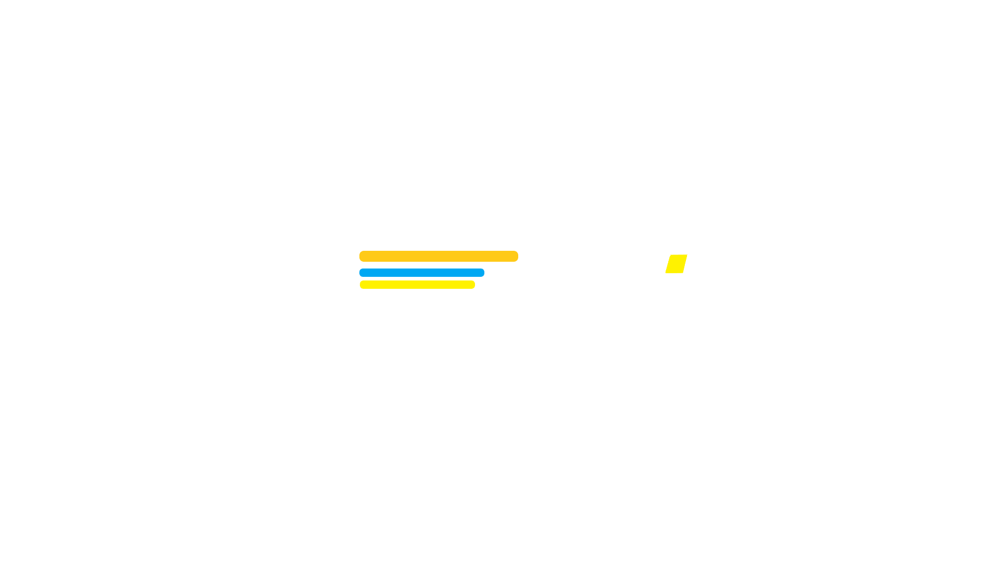

<<<<<<< HEAD
# Cahier des charges - [Yutopia]  

**Cahier des charges pour la réalisation d'éléments graphiques**  

- **Prestataire** : [CONFIDENTIEL]  
- **Date** : [11/03/2025]  
- **Version** : 1.0  

---

## Sommaire  
1. [Contexte et Objectif de la Prestation](#1-contexte-et-objectif-de-la-prestation)  
2. [Éléments à réaliser](#2-éléments-à-réaliser)  
3. [Style et Direction Artistique](#3-style-et-direction-artistique)  
4. [Livrables attendus](#4-livrables-attendus)  
5. [Délais de réalisation](#5-délais-de-réalisation)  
6. [Budget et Conditions](#6-budget-et-conditions)  
7. [Critères de Validation](#7-critères-de-validation)  
8. [Confidentialité](#8-confidentialité)  
9. [Propriété Intellectuelle](#9-propriété-intellectuelle)  
10. [Modifications post-livraison](#10-modifications-post-livraison)  
11. [Applicabilité des Clauses](#11-applicabilité-des-clauses)  
12. [Annexes](#12-annexes)  
13. [Contact](#13-contact)  

---

## 1. Contexte et Objectif de la Prestation  
Le présent cahier des charges a pour but de détailler les paramètres de réalisation d’un **HUD de jeu** destiné au serveur **Garry’s Mod** de la communauté **Yutopia**.  

Cet **HUD** s'inspire de l'interface présente dans l’anime **Sword Art Online (Saison 1)**. Il doit être épuré, futuriste et lisible tout en restant fidèle à l’identité visuelle du serveur.  

---

## 2. Éléments à réaliser  
Le prestataire devra réaliser les éléments suivants :  

- **Nom du joueur** : Affiché en haut de l'interface, dans un cadre arrondi.  
- **Barre de vie (HP)** : Barre principale indiquant les points de vie du joueur.  
- **Barre de mana / énergie** : Affichée sous la barre de vie, en bleu.  
- **Barre de faim** : Positionnée sous la barre de mana.  
- **Indicateur d’état** : Petit rectangle à droite affichant une icône ou un état (permanant ou temporaire) (ex : statut d’armure, stamina, boost, etc.).  
- **Quantité de vie** : Zone sous les barres, affichant le texte indicant le nombre de points de vie restant par rapport a la quantité de points de vie maximal.  

### Dimensions des éléments  
- **Nom du joueur** : 120x30px  
- **Barre de vie** : 300x25px  
- **Barre de mana** : 250x15px  
- **Barre d’expérience** : 250x10px  
- **Indicateur d’état** : 40x40px  
- **Bouton d’activation** : 80x25px  

---

## 3. Style et Direction Artistique  
Le style graphique doit être **futuriste, épuré et lisible**, s’inspirant de l’interface de **SAO (S1)**.  

### Caractéristiques spécifiques du style  
- **Palette de couleurs** :  
  - Un gris neutre et sombre :      `HEX: #373636 | RGB: 55, 54, 54`  
  - Un gris légèrement terreux :    `HEX: #4B4949 | RGB: 75, 73, 73`  
  - Un gris presque noir :          `HEX: #141414 | RGB: 20, 20, 20`  
  - Gris uniforme proche du noir :  `HEX: #282828 | RGB: 40, 40, 40`  
  - Gris foncé uniforme :           `HEX: #1f1f1f | RGB: 31, 31, 31`  
  - Rouge foncé terreux :           `HEX: #943943 | RGB: 148, 57, 67`  

- **Typographie** : [NA] 

- **Formes et contours** : Design **arrondi et épuré**

---

## 4. Livrables attendus  
Le prestataire devra fournir les fichiers suivants à la fin de la prestation :  
- **Fichiers sources** (format AI, PSD ou similaire)  
- **Fichiers exportés en PNG** avec fond transparent  

---

## 5. Délais de réalisation  
**Date limite de livraison** : [N/A].  

---

## 6. Budget et Conditions  
**Modalités de paiement** : Paiement après validation de la version finale.  

---

## 7. Critères de Validation  
Les éléments graphiques seront validés en fonction des critères suivants :  
- **Respect des dimensions et formats**  
- **Cohérence avec la direction artistique demandée**  
- **Lisibilité et fluidité visuelle**  

---

## 8. Confidentialité  
Le prestataire s'engage à respecter la **confidentialité** totale concernant le projet et son commanditaire.  

---

## 9. Propriété Intellectuelle  
Le prestataire **cède tous les droits d'exploitation** des éléments graphiques créés.  

---

## 10. Modifications post-livraison  
- **Modifications incluses** : Ajustements mineurs de couleurs et de contours.  
- **Modifications supplémentaires** : Toute refonte majeure fera l’objet d’un devis complémentaire.  

---

## 11. Applicabilité des Clauses  
| Clause                        | Applicable (Oui/Non) |  
|-------------------------------|----------------------|  
| Confidentialité               | Oui                  |  
| Propriété Intellectuelle      | Oui                  |  
| Modifications post-livraison  | Oui                  |  

---

## 12. Annexes  
### Annexe 1 : Maquette du HUD  

⚠️ **Remarque importante** : Les couleurs utilisées dans la maquette sont indicatives et ne reflètent pas les couleurs finales souhaitées. Le rendu final devra respecter la palette de couleurs spécifiée dans la section "Style et Direction Artistique".
---

## 13. Contact  
=======
# Cahier des charges - [Yutopia]  

**Cahier des charges pour la réalisation d'éléments graphiques**  

- **Prestataire** : [CONFIDENTIEL]  
- **Date** : [11/03/2025]  
- **Version** : 1.0  

---

## Sommaire  
1. [Contexte et Objectif de la Prestation](#1-contexte-et-objectif-de-la-prestation)  
2. [Éléments à réaliser](#2-éléments-à-réaliser)  
3. [Style et Direction Artistique](#3-style-et-direction-artistique)  
4. [Livrables attendus](#4-livrables-attendus)  
5. [Délais de réalisation](#5-délais-de-réalisation)  
6. [Budget et Conditions](#6-budget-et-conditions)  
7. [Critères de Validation](#7-critères-de-validation)  
8. [Confidentialité](#8-confidentialité)  
9. [Propriété Intellectuelle](#9-propriété-intellectuelle)  
10. [Modifications post-livraison](#10-modifications-post-livraison)  
11. [Applicabilité des Clauses](#11-applicabilité-des-clauses)  
12. [Annexes](#12-annexes)  
13. [Contact](#13-contact)  

---

## 1. Contexte et Objectif de la Prestation  
Le présent cahier des charges a pour but de détailler les paramètres de réalisation d’un **HUD de jeu** destiné au serveur **Garry’s Mod** de la communauté **Yutopia**.  

Cet **HUD** s'inspire de l'interface présente dans l’anime **Sword Art Online (Saison 1)**. Il doit être épuré, futuriste et lisible tout en restant fidèle à l’identité visuelle du serveur.  

---

## 2. Éléments à réaliser  
Le prestataire devra réaliser les éléments suivants :  

- **Nom du joueur** : Affiché en haut de l'interface, dans un cadre arrondi.  
- **Barre de vie (HP)** : Barre principale indiquant les points de vie du joueur.  
- **Barre de mana / énergie** : Affichée sous la barre de vie, en bleu.  
- **Barre de faim** : Positionnée sous la barre de mana.  
- **Indicateur d’état** : Petit rectangle à droite affichant une icône ou un état (permanant ou temporaire) (ex : statut d’armure, stamina, boost, etc.).  
- **Quantité de vie** : Zone sous les barres, affichant le texte indicant le nombre de points de vie restant par rapport a la quantité de points de vie maximal.  

### Dimensions des éléments  
- **Nom du joueur** : 120x30px  
- **Barre de vie** : 300x25px  
- **Barre de mana** : 250x15px  
- **Barre d’expérience** : 250x10px  
- **Indicateur d’état** : 40x40px  
- **Bouton d’activation** : 80x25px  

---

## 3. Style et Direction Artistique  
Le style graphique doit être **futuriste, épuré et lisible**, s’inspirant de l’interface de **SAO (S1)**.  

### Caractéristiques spécifiques du style  
- **Palette de couleurs** :  
  - Un gris neutre et sombre :      `HEX: #373636 | RGB: 55, 54, 54`  
  - Un gris légèrement terreux :    `HEX: #4B4949 | RGB: 75, 73, 73`  
  - Un gris presque noir :          `HEX: #141414 | RGB: 20, 20, 20`  
  - Gris uniforme proche du noir :  `HEX: #282828 | RGB: 40, 40, 40`  
  - Gris foncé uniforme :           `HEX: #1f1f1f | RGB: 31, 31, 31`  
  - Rouge foncé terreux :           `HEX: #943943 | RGB: 148, 57, 67`  

- **Typographie** : [NA] 

- **Formes et contours** : Design **arrondi et épuré**

---

## 4. Livrables attendus  
Le prestataire devra fournir les fichiers suivants à la fin de la prestation :  
- **Fichiers sources** (format AI, PSD ou similaire)  
- **Fichiers exportés en PNG** avec fond transparent  

---

## 5. Délais de réalisation  
**Date limite de livraison** : [N/A].  

---

## 6. Budget et Conditions  
**Modalités de paiement** : Paiement après validation de la version finale.  

---

## 7. Critères de Validation  
Les éléments graphiques seront validés en fonction des critères suivants :  
- **Respect des dimensions et formats**  
- **Cohérence avec la direction artistique demandée**  
- **Lisibilité et fluidité visuelle**  

---

## 8. Confidentialité  
Le prestataire s'engage à respecter la **confidentialité** totale concernant le projet et son commanditaire.  

---

## 9. Propriété Intellectuelle  
Le prestataire **cède tous les droits d'exploitation** des éléments graphiques créés.  

---

## 10. Modifications post-livraison  
- **Modifications incluses** : Ajustements mineurs de couleurs et de contours.  
- **Modifications supplémentaires** : Toute refonte majeure fera l’objet d’un devis complémentaire.  

---

## 11. Applicabilité des Clauses  
| Clause                        | Applicable (Oui/Non) |  
|-------------------------------|----------------------|  
| Confidentialité               | Oui                  |  
| Propriété Intellectuelle      | Oui                  |  
| Modifications post-livraison  | Oui                  |  

---

## 12. Annexes  
### Annexe 1 : Maquette du HUD  

⚠️ **Remarque importante** : Les couleurs utilisées dans la maquette sont indicatives et ne reflètent pas les couleurs finales souhaitées. Le rendu final devra respecter la palette de couleurs spécifiée dans la section "Style et Direction Artistique".
---

## 13. Contact  
>>>>>>> a57eb860442437bdcdecd8be8d1d79fcf65f3e1c
Pour toute question, contacter le commanditaire via **Discord**.