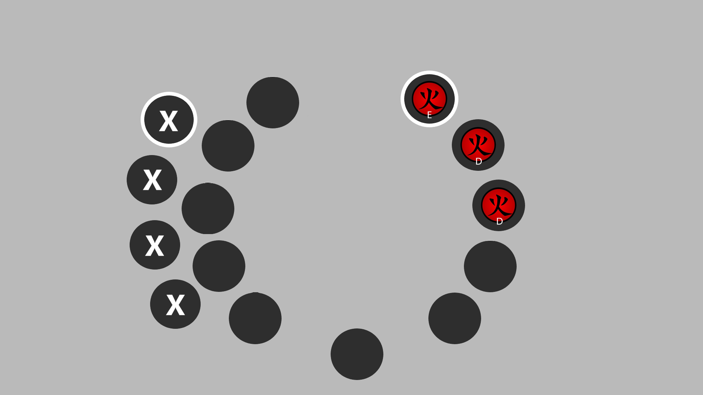

<<<<<<< HEAD
# Cahier des charges - [Yutopia]

**Cahier des charges pour la réalisation d'éléments graphiques**  

- **Prestataire** : [CONFIDENTIEL]  
- **Date** : [11/03/2025]  
- **Version** : 1.1  

---

## Sommaire
1. [Contexte et Objectif de la Prestation](#1-contexte-et-objectif-de-la-prestation)  
2. [Éléments à réaliser](#2-éléments-à-réaliser)  
3. [Style et Direction Artistique](#3-style-et-direction-artistique)  
4. [Livrables attendus](#4-livrables-attendus)  
5. [Délais de réalisation](#5-délais-de-réalisation)  
6. [Budget et Conditions](#6-budget-et-conditions)  
7. [Critères de Validation](#7-critères-de-validation)  
8. [Confidentialité](#8-confidentialité)  
9. [Propriété Intellectuelle](#9-propriété-intellectuelle)  
10. [Modifications post-livraison](#10-modifications-post-livraison)  
11. [Applicabilité des Clauses](#11-applicabilité-des-clauses)  
12. [Annexes](#12-annexes)  
13. [Contact](#13-contact)  

---

## 1. Contexte et Objectif de la Prestation  
Le présent cahier des charges a pour but de détailler les paramètres de réalisation d'un **sélecteur radial d'attaques** pour le serveur de jeu **Garry’s Mod** de la communauté **Yutopia**.  
Ce menu doit permettre aux joueurs de sélectionner leurs attaques en fonction du déplacement de la souris, avec une interface fluide et intuitive inspirée des sélecteurs d’armes des jeux **GTA V** et **Red Dead Redemption 2**.  

---

## 2. Éléments à réaliser  
Le prestataire devra réaliser les éléments suivants pour le menu radial de sélection d'attaques :
- **Slots de sélection** : Des emplacements circulaires indiquant les attaques disponibles.  
- **Indicateur de sélection active** : Un contour sur le slot actuellement sélectionné.  
- **Icônes des attaques** : Des pictogrammes différenciés selon l’attaque équipée.  
- **Lettres de rang** : Indication de la **puissance de l’attaque**, allant de "E" (attaque la plus faible) à "S" (attaque la plus forte), en passant par "D", "C", "B" et "A".  

### Dimensions des éléments   
- **Slots de sélection** : 120x120px  
- **Contour de sélection active** : 140x140px  
- **Icônes d’attaques** : 100x100px  
- **Taille des rangs affichés** : 50x50px  

---

## 3. Style et Direction Artistique  
Le style graphique doit être **moderne, minimaliste et sombre**, avec des éléments lisibles et une mise en avant des attaques sélectionnées.  

### Caractéristiques spécifiques du style  
- **Palette de couleurs** :  
  - Un gris neutre et sombre :      `HEX: #373636 | RGB: 55, 54, 54`  
  - Un gris légèrement terreux :    `HEX: #4B4949 | RGB: 75, 73, 73`  
  - Un gris presque noir :          `HEX: #141414 | RGB: 20, 20, 20`  
  - Gris uniforme proche du noir :  `HEX: #282828 | RGB: 40, 40, 40`  
  - Gris foncé uniforme :           `HEX: #1f1f1f | RGB: 31, 31, 31`  
  - Rouge foncé terreux :           `HEX: #943943 | RGB: 148, 57, 67`  

- **Typographie** : [NA] 

- **Formes et contours** : Design **arrondi et épuré** 

---

## 4. Livrables attendus  
Le prestataire devra fournir les fichiers suivants à la fin de la prestation :  
- **Fichiers sources** (format AI, PSD ou similaire)  
- **Fichiers exportés en PNG** avec fond transparent  

---

## 5. Délais de réalisation  
**Date limite de livraison** : À définir en accord avec le commanditaire.  

---

## 6. Budget et Conditions  
**Modalités de paiement** : Paiement après validation de la version finale.  

---

## 7. Critères de Validation  
Les éléments graphiques seront validés en fonction des critères suivants :  
- **Respect des dimensions et formats**  
- **Cohérence avec la direction artistique demandée**  
- **Lisibilité et fluidité visuelle**  

---

## 8. Confidentialité  
Le prestataire s'engage à respecter la **confidentialité** totale concernant le projet et son commanditaire.  

---

## 9. Propriété Intellectuelle  
Le prestataire **cède tous les droits d'exploitation** des éléments graphiques créés.  

---

## 10. Modifications post-livraison  
- **Modifications incluses** : Ajustements mineurs de couleurs et de contours.  
- **Modifications supplémentaires** : Toute refonte majeure fera l’objet d’un devis complémentaire.  

---

## 11. Applicabilité des Clauses  
| Clause                        | Applicable (Oui/Non) |  
|-------------------------------|----------------------|  
| Confidentialité               | Oui                  |  
| Propriété Intellectuelle      | Oui                  |  
| Modifications post-livraison  | Oui                  |  

---

## 12. Annexes  
### Annexe 1 : Exemple d’éléments graphiques  
    
⚠️ **Remarque importante** : Les couleurs utilisées dans la maquette sont indicatives et ne reflètent pas les couleurs finales souhaitées. Le rendu final devra respecter la palette de couleurs spécifiée dans la section "Style et Direction Artistique".
---

## 13. Contact  
Pour toute question, contacter le commanditaire via **Discord**.  
=======
# Cahier des charges - [Yutopia]

**Cahier des charges pour la réalisation d'éléments graphiques**  

- **Prestataire** : [CONFIDENTIEL]  
- **Date** : [11/03/2025]  
- **Version** : 1.1  

---

## Sommaire
1. [Contexte et Objectif de la Prestation](#1-contexte-et-objectif-de-la-prestation)  
2. [Éléments à réaliser](#2-éléments-à-réaliser)  
3. [Style et Direction Artistique](#3-style-et-direction-artistique)  
4. [Livrables attendus](#4-livrables-attendus)  
5. [Délais de réalisation](#5-délais-de-réalisation)  
6. [Budget et Conditions](#6-budget-et-conditions)  
7. [Critères de Validation](#7-critères-de-validation)  
8. [Confidentialité](#8-confidentialité)  
9. [Propriété Intellectuelle](#9-propriété-intellectuelle)  
10. [Modifications post-livraison](#10-modifications-post-livraison)  
11. [Applicabilité des Clauses](#11-applicabilité-des-clauses)  
12. [Annexes](#12-annexes)  
13. [Contact](#13-contact)  

---

## 1. Contexte et Objectif de la Prestation  
Le présent cahier des charges a pour but de détailler les paramètres de réalisation d'un **sélecteur radial d'attaques** pour le serveur de jeu **Garry’s Mod** de la communauté **Yutopia**.  
Ce menu doit permettre aux joueurs de sélectionner leurs attaques en fonction du déplacement de la souris, avec une interface fluide et intuitive inspirée des sélecteurs d’armes des jeux **GTA V** et **Red Dead Redemption 2**.  

---

## 2. Éléments à réaliser  
Le prestataire devra réaliser les éléments suivants pour le menu radial de sélection d'attaques :
- **Slots de sélection** : Des emplacements circulaires indiquant les attaques disponibles.  
- **Indicateur de sélection active** : Un contour sur le slot actuellement sélectionné.  
- **Icônes des attaques** : Des pictogrammes différenciés selon l’attaque équipée.  
- **Lettres de rang** : Indication de la **puissance de l’attaque**, allant de "E" (attaque la plus faible) à "S" (attaque la plus forte), en passant par "D", "C", "B" et "A".  

### Dimensions des éléments   
- **Slots de sélection** : 120x120px  
- **Contour de sélection active** : 140x140px  
- **Icônes d’attaques** : 100x100px  
- **Taille des rangs affichés** : 50x50px  

---

## 3. Style et Direction Artistique  
Le style graphique doit être **moderne, minimaliste et sombre**, avec des éléments lisibles et une mise en avant des attaques sélectionnées.  

### Caractéristiques spécifiques du style  
- **Palette de couleurs** :  
  - Un gris neutre et sombre :      `HEX: #373636 | RGB: 55, 54, 54`  
  - Un gris légèrement terreux :    `HEX: #4B4949 | RGB: 75, 73, 73`  
  - Un gris presque noir :          `HEX: #141414 | RGB: 20, 20, 20`  
  - Gris uniforme proche du noir :  `HEX: #282828 | RGB: 40, 40, 40`  
  - Gris foncé uniforme :           `HEX: #1f1f1f | RGB: 31, 31, 31`  
  - Rouge foncé terreux :           `HEX: #943943 | RGB: 148, 57, 67`  

- **Typographie** : [NA] 

- **Formes et contours** : Design **arrondi et épuré** 

---

## 4. Livrables attendus  
Le prestataire devra fournir les fichiers suivants à la fin de la prestation :  
- **Fichiers sources** (format AI, PSD ou similaire)  
- **Fichiers exportés en PNG** avec fond transparent  

---

## 5. Délais de réalisation  
**Date limite de livraison** : À définir en accord avec le commanditaire.  

---

## 6. Budget et Conditions  
**Modalités de paiement** : Paiement après validation de la version finale.  

---

## 7. Critères de Validation  
Les éléments graphiques seront validés en fonction des critères suivants :  
- **Respect des dimensions et formats**  
- **Cohérence avec la direction artistique demandée**  
- **Lisibilité et fluidité visuelle**  

---

## 8. Confidentialité  
Le prestataire s'engage à respecter la **confidentialité** totale concernant le projet et son commanditaire.  

---

## 9. Propriété Intellectuelle  
Le prestataire **cède tous les droits d'exploitation** des éléments graphiques créés.  

---

## 10. Modifications post-livraison  
- **Modifications incluses** : Ajustements mineurs de couleurs et de contours.  
- **Modifications supplémentaires** : Toute refonte majeure fera l’objet d’un devis complémentaire.  

---

## 11. Applicabilité des Clauses  
| Clause                        | Applicable (Oui/Non) |  
|-------------------------------|----------------------|  
| Confidentialité               | Oui                  |  
| Propriété Intellectuelle      | Oui                  |  
| Modifications post-livraison  | Oui                  |  

---

## 12. Annexes  
### Annexe 1 : Exemple d’éléments graphiques  
    
⚠️ **Remarque importante** : Les couleurs utilisées dans la maquette sont indicatives et ne reflètent pas les couleurs finales souhaitées. Le rendu final devra respecter la palette de couleurs spécifiée dans la section "Style et Direction Artistique".
---

## 13. Contact  
Pour toute question, contacter le commanditaire via **Discord**.  
>>>>>>> a57eb860442437bdcdecd8be8d1d79fcf65f3e1c
